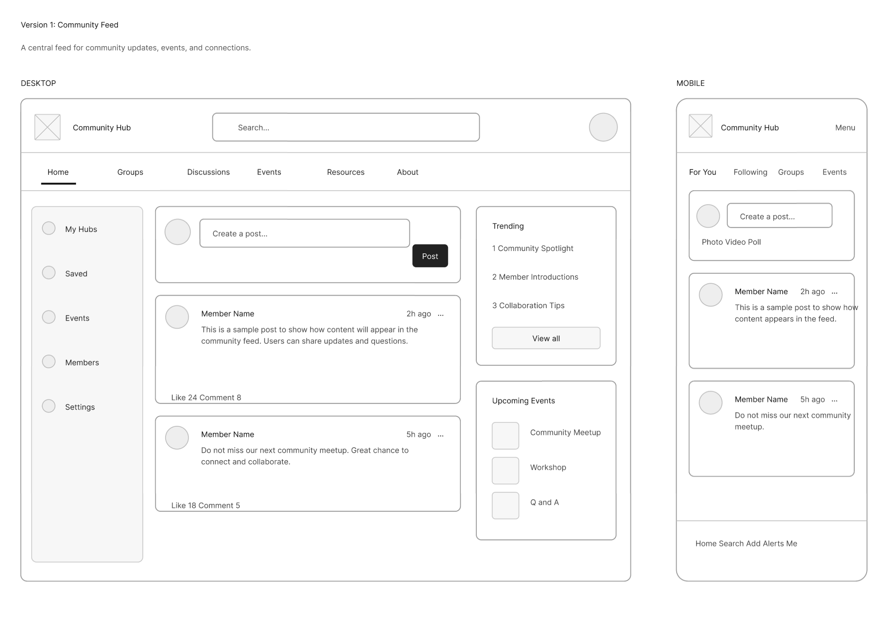
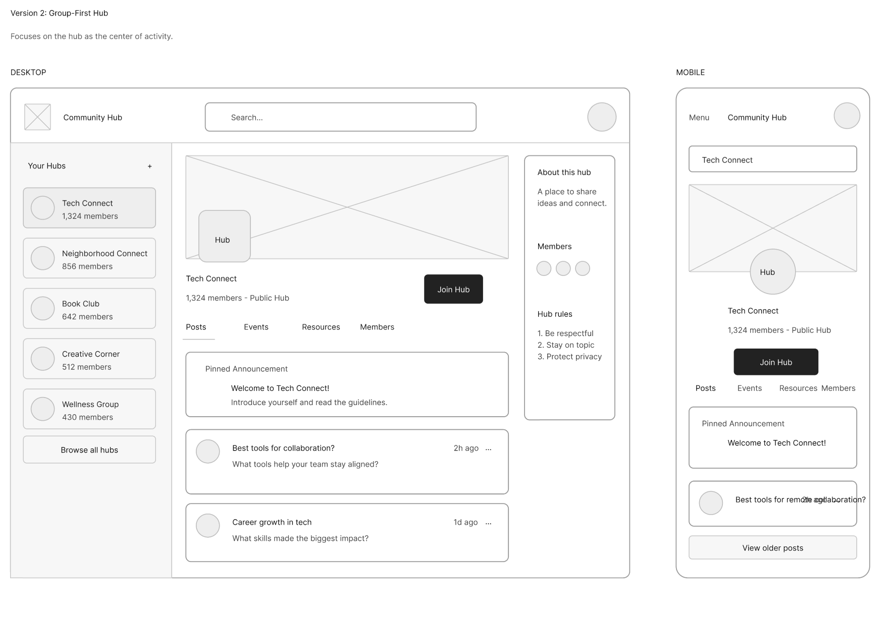
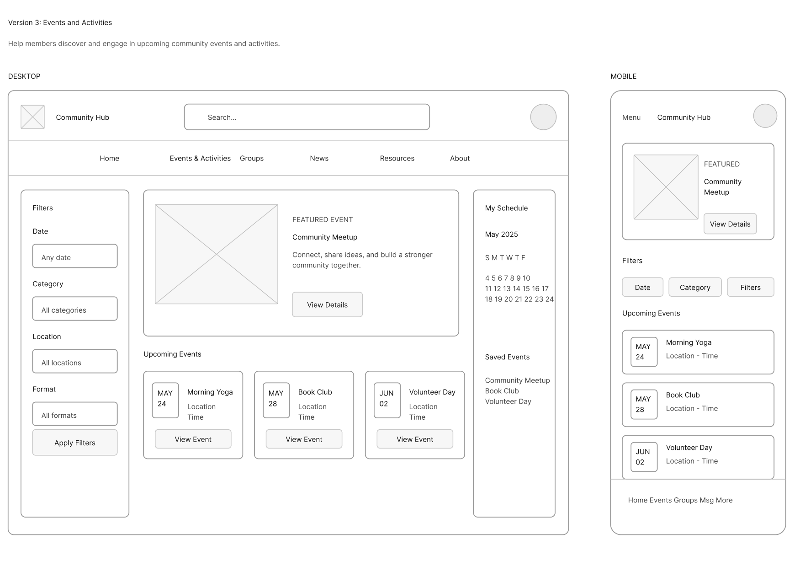
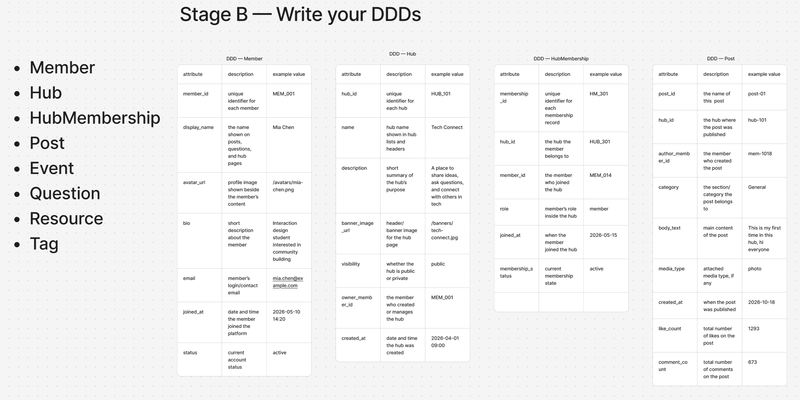
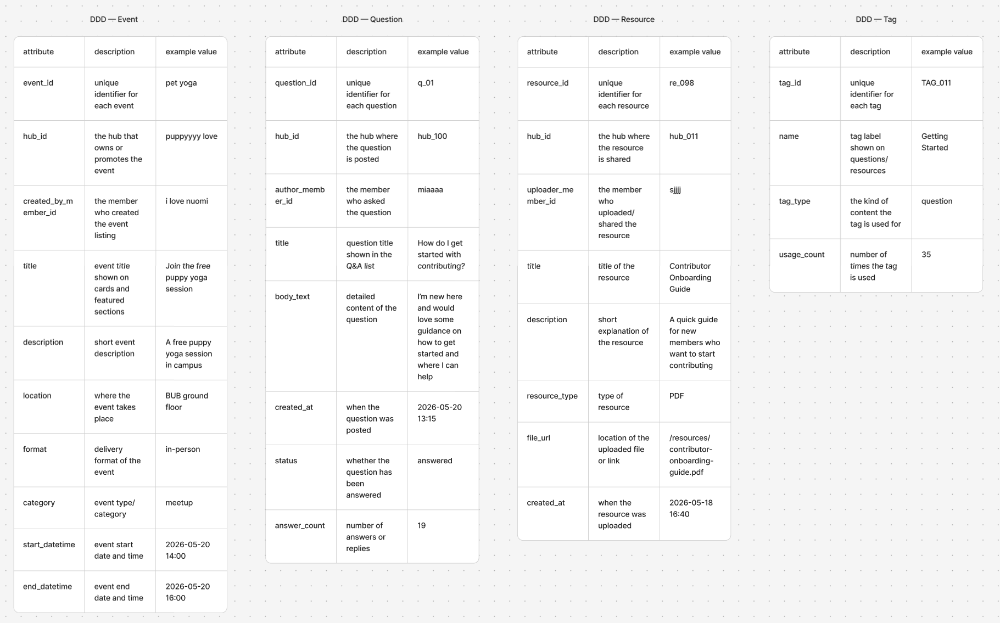
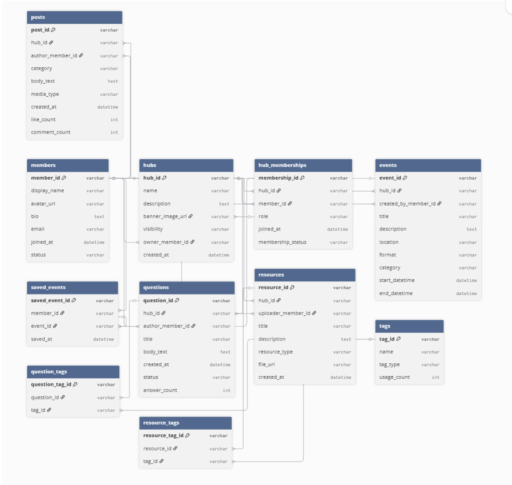

This week I moved from just thinking about the screen layout to thinking about the data behind the interface. In the lecture, the difference between a wireframe, a DDD, and an ERD made the project feel a bit clearer. The wireframe is what the user sees. The DDD is what data each part of the page needs. The ERD is how those pieces of data connect in the system.

I started with the four wireframes I made earlier. I did not want to lock the project into one theme too early, so these wireframes are still based on a general community hub. Each version tests a different structure: a normal feed, a group-first page, an events page, and a Q&A/resources page.

The first wireframe is based on a community feed. This helped me identify common data such as member names, post text, timestamps, likes, comments, trending topics, and upcoming events. Some data is displayed, such as the member name and post content. Some data is input, such as the create-post box and search bar. Some data is generated by the system, such as “2h ago”, like counts, and trending order.

The second wireframe focuses more on the hub itself. This made me think about data that is not only about posts. A hub needs a name, description, banner image, member count, rules, and visibility status. It also needs membership data, because a user can join more than one hub, and one hub can have many members.

The third wireframe helped me separate event data from normal post data. Events need a title, date, time, location, category, format, and saved status. These are different from a normal post because users may filter them, save them, and view them through a schedule or calendar.

The fourth wireframe is about Q&A and resources. This was useful because it brought in questions, resources, tags, answered status, and upload actions. It also showed that tags could belong to more than one type of content, so they should probably be separate from the question or resource itself.

After annotating the wireframes, I wrote the DDDs. I used the three-column format from the lecture: attribute, description, and example value. I wrote DDDs for the main entities: Member, Hub, HubMembership, Post, Event, Question, Resource, and Tag.

Writing the DDDs made me notice that some things on the page are actually separate entities. For example, a hub is not just a title on the page. It has members, posts, events, questions, resources, and tags connected to it. Also, HubMembership needs to exist because the relationship between Member and Hub is many-to-many.

Finally, I used the DDDs to sketch the ERD. This helped me see the structure of the system instead of only seeing separate screens.

The main structure is that a Member can join many Hubs, and a Hub can have many Members, so HubMembership works as the joining table. A Hub can contain many Posts, Events, Questions, and Resources. A Member can create posts, ask questions, upload resources, and create or save events. Tags also need joining tables because one question or resource can have many tags, and one tag can be used many times.

This process made the wireframes feel less random. Before this, I was mainly looking at layout and page hierarchy. Now I can see what kind of data each screen needs and how the whole community hub could work as one connected system.