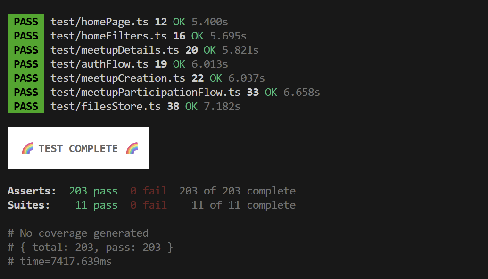
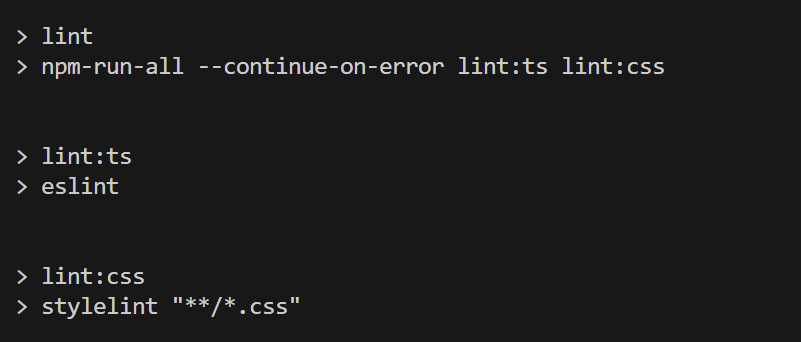
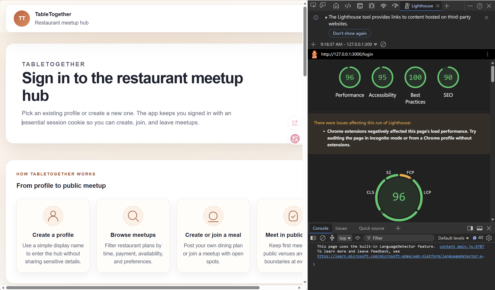
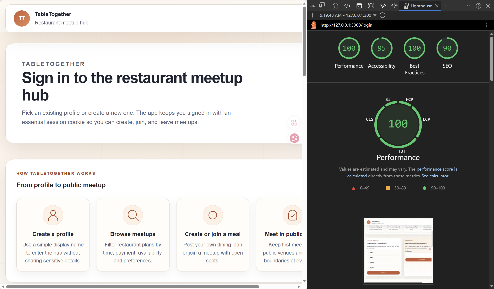
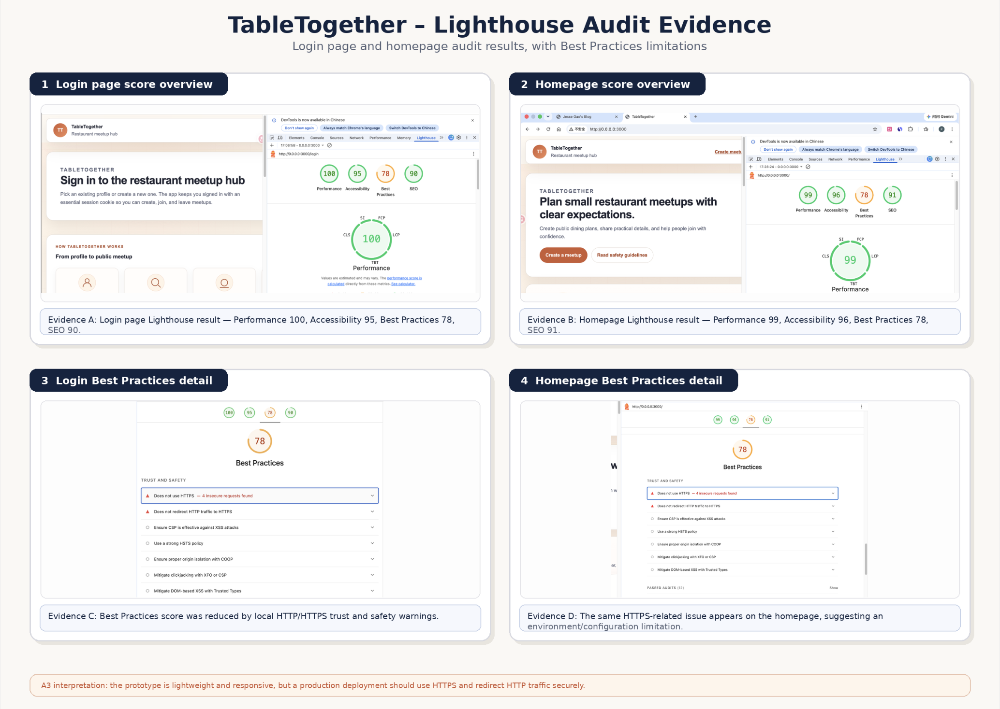
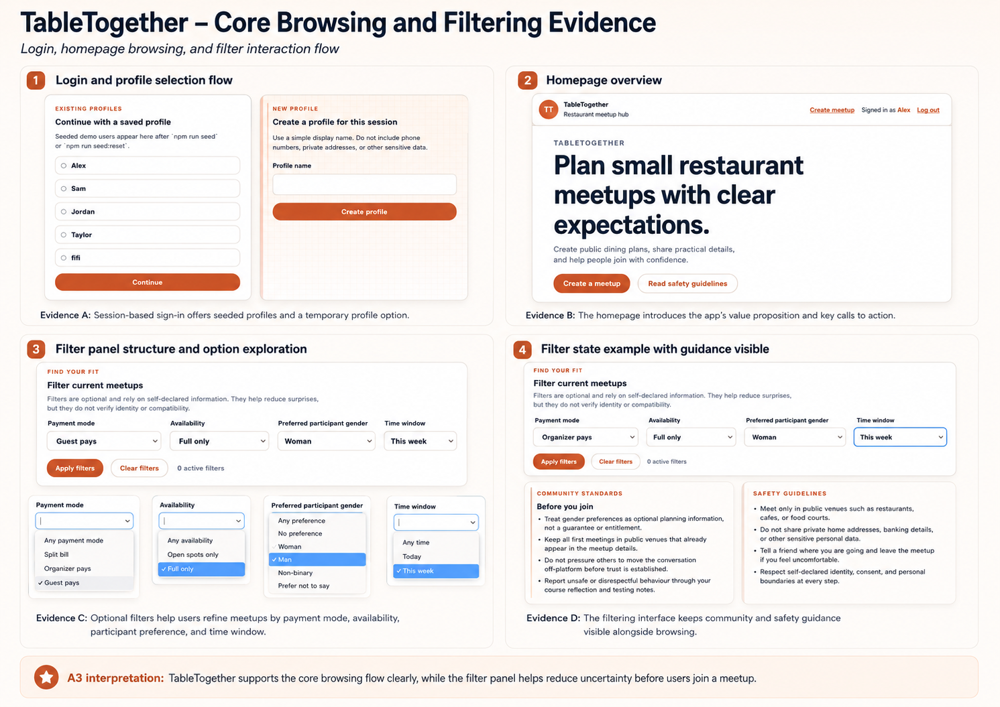
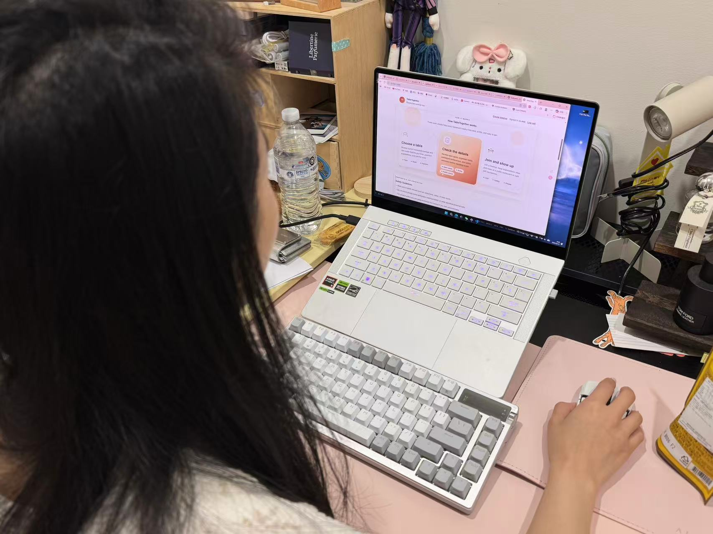

# Final Reflection: Evaluating TableTogether
For our final group project, we built TableTogether, a restaurant meetup hub for BlaBla Corp. The application allows users to sign in with a profile, browse restaurant meetups, filter them by practical preferences, create a new meetup, and join or leave existing plans. In A1, our focus was mostly on planning what we wanted to build and why. For A3, my focus is different: I am looking back at the final prototype and evaluating how well it actually performed as a deployed web system.

## 1. Performance and Technical Behaviour
Overall, TableTogether performed reliably during our technical testing. The strongest evidence for this was the automated test suite. Our tests covered the main flows of the application, including authentication, the homepage, filters, meetup details, meetup creation, join/leave behaviour, and file upload handling. The test run passed 203 out of 203 assertions, with 11 out of 11 test suites passing. This gave me confidence that the core server-side behaviour was stable.

*Figure 1: Automated test result*

*Figure 2: Linting result*

**Evidence Table 1: Automated Technical Checks**

| Check | Result | What this shows |
|---|---|---|
| Automated tests | 203/203 passed | Core app flows behaved as expected |
| Test suites | 11/11 passed | Main route and model areas were covered |
| Linting | Passed | TypeScript and CSS style checks completed successfully |
| Main tested flows | Auth, filters, meetup creation, detail pages, join/leave | The prototype was technically reliable for its intended use case |

One technical strength of the prototype is that the core logic is simple and appropriate for the project scope. We used server-rendered pages, SQLite storage, and direct route/controller/model structures. This made the app feel responsive locally and avoided unnecessary front-end complexity. The join/leave flow is a good example of this. Users cannot join the same meetup twice, cannot join when a meetup is full, and can leave to free a spot again. These behaviours are small but important because the usefulness of the app depends on accurate capacity tracking.

The Lighthouse results also showed strong technical performance. The mobile Lighthouse result showed Performance 96, Accessibility 95, Best Practices 100, and SEO 90. The desktop Lighthouse result showed Performance 100, Accessibility 95, Best Practices 100, and SEO 90. These scores suggest that the prototype is lightweight and responsive, especially because it does not rely on a large client-side framework.

*Figure 3: Mobile Lighthouse audit result*

*Figure 4: Desktop Lighthouse audit result*

**Evidence Table 2: Lighthouse Results**

| Device | Performance | Accessibility | Best Practices | SEO |
|---|---:|---:|---:|---:|
| Mobile | 96 | 95 | 100 | 90 |
| Desktop | 100 | 95 | 100 | 90 |

We also created a broader Lighthouse evidence board comparing the login page and homepage. This was useful because it showed that performance remained high beyond just one page. The homepage result recorded Performance 99, Accessibility 96, Best Practices 78, and SEO 91. The lower Best Practices score was caused by local HTTP/HTTPS trust and safety warnings, not by a broken user-facing feature. This distinction matters: the local prototype performed well, but a production deployment should use HTTPS and redirect HTTP traffic securely.

*Figure 5: Lighthouse audit evidence board*

A limitation of our performance evaluation is that we tested with a small prototype dataset. I can say that TableTogether performs well for the intended demo scale, but I cannot claim it would perform equally well with hundreds or thousands of meetups. If we continued development, I would add pagination, database indexing, image loading controls, and testing with larger seeded datasets.

## 2. User Experience and Accessibility
The user experience is strongest in the core browsing flow. The homepage clearly communicates the purpose of the application: helping users plan small restaurant meetups with clear expectations. The interface shows practical information such as time, seats, payment mode, availability, participant preferences, and safety guidance. This supports the main goal we identified during planning, which was reducing uncertainty before users join a social dining event.

The filter panel is one of the most successful parts of the interface. Users can narrow meetups by payment mode, availability, preferred participant gender, and time window. These filters match real user concerns. For example, someone may care about whether a meetup has open spots, whether the payment expectation is clear, or whether the timing works for them. The filtering interaction helps users make decisions without needing to open every meetup one by one.

*Figure 6: Core browsing and filtering evidence*

We also evaluated usability through a short peer testing session. The tester was asked to sign in, browse meetups, use filters, open details, and move through the meetup decision flow. The feedback was mostly positive. The tester understood the purpose of the app quickly and found the main browsing path clear. The main friction was that some information-heavy sections required scrolling, and the tester expected the filter result count to update more visibly after applying filters.

*Figure 7: Peer user testing*

**Evidence Table 3: User Testing Summary**

| Task | Result | Observation |
|---|---|---|
| Sign in with a profile | Completed without help | The seeded profile list made login quick and understandable |
| Understand homepage purpose | Completed quickly | The heading and hero text clearly communicated the app concept |
| Browse meetup information | Completed without help | The tester could identify time, payment, availability, and safety information |
| Use filters | Completed with minor hesitation | The filter categories were clear, but the tester expected stronger feedback after applying filters |
| Review safety guidance | Completed | Safety and public venue reminders were visible and easy to understand |
| Navigate toward creating/joining a meetup | Completed | Main calls to action were visible, although the page length required scrolling |

Accessibility was also considered in the prototype. The app uses visible labels, headings, readable button text, and alt text for meetup images. Lighthouse accessibility scores were strong, with 95 on the login page and 96 on the homepage evidence board. This suggests that the basic structure of the interface is accessible.

However, I would not claim the accessibility is complete. Lighthouse is useful, but it cannot fully replace keyboard-only testing, screen reader testing, or testing with users who have different accessibility needs. If I continued the project, I would check focus visibility more carefully, make sure all interactive controls are comfortable to reach by keyboard, and test contrast against WCAG AA standards. I would also improve some content polish. For example, small text or encoding issues can reduce trust even when the app technically works.

## 3. Functional Requirements
Looking back at our original functional requirements, I think the final prototype met the most important ones. Users can sign in, browse meetups, filter results, create a meetup, view details, and join or leave. These features match the core purpose of TableTogether.

**Evidence Table 4: Functional Requirement Review**

| Requirement | Final status | Reflection |
|---|---|---|
| Sign in with a profile | Met | Suitable for a prototype, though not a full account system |
| Browse restaurant meetups | Met | The homepage supports the main discovery flow |
| Filter meetups | Met | Filters help users narrow choices by practical criteria |
| Create a meetup | Met | The form collects key planning and safety information |
| View meetup details | Met | Users can review important information before joining |
| Join and leave meetups | Met | Capacity and duplicate-join logic worked in testing |
| Safety guidance | Met | Public venue and consent reminders appear across the experience |
| Full production security/account system | Rescoped | Too large for the prototype scope |

Some requirements were deliberately simplified. We used reusable test profiles instead of a complete signup and identity system. This was appropriate for the assignment because the goal was to demonstrate the meetup experience, not build a full authentication platform. We also focused on restaurant meetup planning rather than adding chat, reporting, notifications, or map integration. In hindsight, this was the right decision. The prototype is stronger because it focuses on one clear user journey.

## 4. Lessons Learned and Improvements
The biggest lesson I learned is that evaluation changes how I see the project. During development, it is easy to think mainly about whether a feature works. During evaluation, I had to ask whether the feature works clearly, quickly, accessibly, and safely for users. A passing test suite is important, but it does not prove that users understand the interface. Similarly, a high Lighthouse score is encouraging, but it does not prove that the whole experience feels smooth.

I also learned that responsible design has to be built into the interaction flow, not just added as a paragraph of text. In TableTogether, safety guidance appears on the homepage and around meetup decisions, which helps remind users that this is a social app involving real-world meetings. If we continued the project, I would make this even stronger with reporting tools, clearer moderation pathways, and stronger privacy decisions around user profiles.

My main improvement priorities would be: first, test with more users and collect more structured feedback; second, improve filter feedback and empty states; third, add stronger keyboard and screen reader testing; fourth, prepare the app for production with HTTPS and better deployment security; and fifth, test performance with a larger dataset.

Overall, I think TableTogether succeeded as a functional and responsive prototype. It met our main functional requirements and performed well in automated tests and Lighthouse audits. At the same time, the evaluation showed that a good prototype is not the same as a finished system. The next stage would be less about adding many new features and more about improving trust, accessibility, feedback, and real-world reliability. This project helped me understand that evaluating a web application means looking at both technical behaviour and human experience.